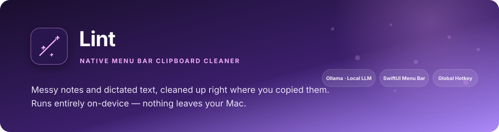
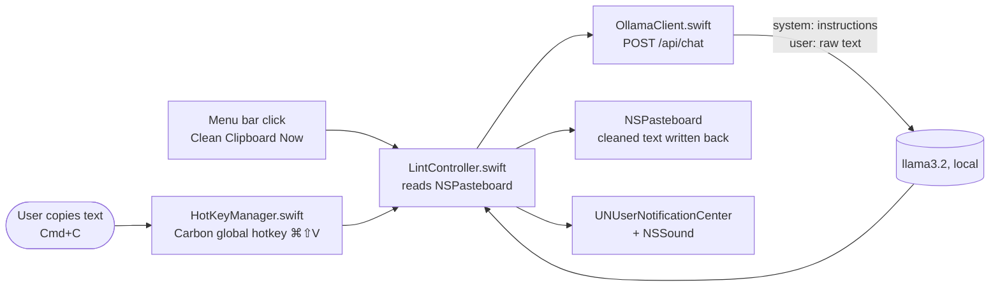

<p align="center">
  
</p>

<div align="center">

# Lint

### A native menu bar clipboard cleaner, powered by a local LLM

Copy rough text. Press a hotkey. Paste it clean. Nothing ever leaves your Mac.

[](https://swift.org/)
[]()
[](https://ollama.com)
[]()
[](LICENSE)

</div>

---

<div align="center">

| Global hotkey | Local-only | Standalone | Runs at login |
|:---:|:---:|:---:|:---:|
| `⌘⇧V`, OS-level (Carbon Hot Key Manager) | Ollama on-device — no cloud API call, ever | No Xcode/debugger dependency | Registered as a macOS Login Item |

</div>

## Why this exists

A friend with AI industry experience made the case that the fastest way to
actually learn the native-app + local-AI development process — not just read
about it — is to build something that solves a problem I personally have,
end to end, on my own machine. I clean up rushed notes and dictated text
constantly; this was the obvious first project in that series.

I chose a **local** model over a cloud API on purpose: this app touches
whatever happens to be on my clipboard at any given moment, and there's no
reason that should ever leave the machine.

> **Related work in this portfolio:** first in a four-app series exploring
> native macOS development — the menu bar + local-LLM scaffolding built here
> (hotkey handling, Ollama client, notification delegate) is reused directly
> by the next app, a Jira sprint-status menu bar brief.

## At a glance

| | |
|---|---|
| **Problem** | Rough, filler-word-heavy notes and dictated text need cleanup before they go somewhere permanent (Slack, email, tickets) |
| **Approach** | Global OS hotkey captures clipboard text, sends it to a local Ollama model with a chat-role prompt, writes the cleaned result back |
| **Proof** | Verified against both realistic long-form input and adversarial short/ambiguous input (see bugs below) |
| **Output** | Cleaned clipboard text, in place, plus a visual + audible confirmation |

## Competencies demonstrated

| Competency | Observable evidence |
|---|---|
| Native macOS development | SwiftUI `MenuBarExtra` scene, AppKit interop, Carbon `RegisterEventHotKey` for a true system-level global hotkey |
| Local LLM integration | Ollama `/api/chat` client with system/user role separation instead of one blended prompt |
| Prompt engineering | Diagnosed and fixed a small model blending instructions into its own output; verified fixes against the raw API with `curl` before touching app code |
| Systems debugging | Isolated a silent failure by adding stage-by-stage status logging (hotkey registration → event delivery → network call) rather than guessing |
| macOS platform depth | App Sandbox network entitlements, the one-time notification permission model, and a notification-sound delegate quirk |
| Shipping discipline | Debug → Release build, standalone launch outside Xcode, registered as a Login Item |

## Real example

**Copied:**
> so basically um we need to like fix the login bug and also the payment thing is broken too and idk whos on it

**Pasted, after `⌘⇧V`:**
> We need to fix the login bug and the payment issue is also broken. I'm not sure who is responsible for addressing these issues.

## Three real bugs found building this

1. **Small models blend instructions and content when both share one prompt.**
   Using Ollama's `/api/generate` with a single string containing both the
   cleanup instructions and the user's text, short/ambiguous input (e.g.
   `"test messy text"`) caused the model to respond *to* the instructions
   conversationally instead of transforming the content — output like *"Please
   provide the messy text you would like me to clean."* Root-caused by testing
   the same prompt directly against the Ollama API with `curl`, isolated from
   the Swift app entirely. Fixed by switching to `/api/chat` with the
   instructions in a `system` message and the raw text in a separate `user`
   message — the boundary a chat-tuned model is actually trained to respect.

2. **A silently-failing global hotkey looked identical to a silently-failing
   network call.** When the hotkey appeared to do nothing, the cause could
   have been Carbon registration failing, the event never reaching the
   callback, or the Ollama request failing — three different layers with one
   symptom. Added explicit status logging at each stage
   (`InstallEventHandler`/`RegisterEventHotKey` return codes, a print in the
   callback itself, and a print around the network call) to identify exactly
   which layer was at fault before writing a single fix.

3. **Notifications a background app posts about itself drop their sound
   silently.** Permission was granted, Notification Center showed the message,
   but no sound ever played — a macOS default-presentation quirk for
   accessory/foreground apps, not a settings problem. Fixed by adding a
   `UNUserNotificationCenterDelegate` to explicitly request `.banner` +
   `.sound`, and, since that alone proved unreliable, also playing
   `NSSound(named: "Glass")` directly on success — decoupled from the
   notification framework entirely.

## Architecture



## Setup

Requires [Ollama](https://ollama.com) running locally with a model pulled:

```bash
brew install ollama
ollama pull llama3.2
```

Open `Lint.xcodeproj` in Xcode and run, or build a standalone copy:

```bash
xcodebuild -project Lint.xcodeproj -scheme Lint -configuration Release build
```

## Usage

1. Copy any rough text (`⌘C`)
2. Press `⌘⇧V` anywhere — or click the 🪄 menu bar icon → **Clean Clipboard Now**
3. Paste (`⌘V`) — the cleaned version is now on your clipboard

## Contact

<div align="center">

### **Navi Sohi**
*Technical Program Manager & Automation Engineer*

<a href="https://www.linkedin.com/in/navisohi/"></a>
<a href="https://github.com/PlainJane20"></a>
<a href="mailto:nks.ai.dev@gmail.com"></a>

</div>

## License

Copyright © 2026 Navi Sohi.

This project is distributed under the [MIT License](LICENSE). Reuse is permitted under the
license terms, provided the copyright and license notice are retained in copies or substantial
portions of the software.
