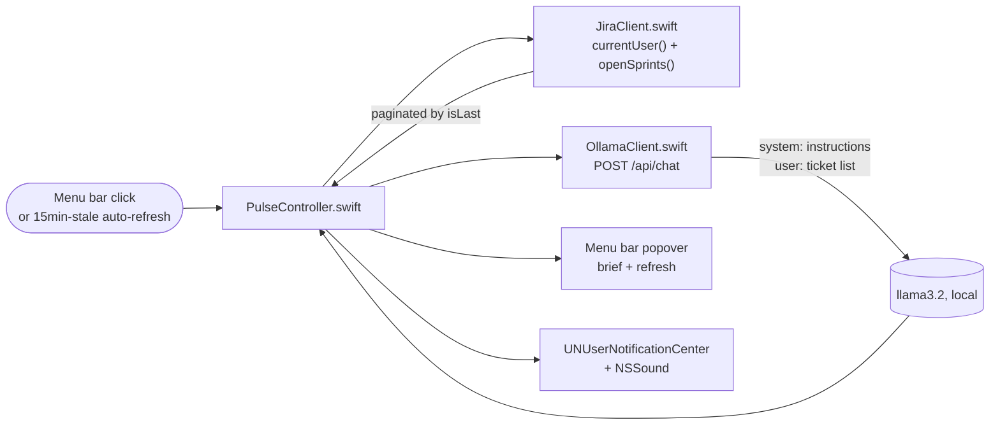

<p align="center">
  
</p>

<div align="center">

# Pulse

### A native menu bar Jira sprint brief, powered by a local LLM

Your tickets, any active sprint, any project — summarized where you can see it at a glance.

[](https://swift.org/)
[]()
[](https://ollama.com)
[](https://developer.atlassian.com/)
[]()
[](LICENSE)

</div>

---

<div align="center">

| Any Jira instance | Local-only | Standalone | Runs at login |
|:---:|:---:|:---:|:---:|
| `currentUser()` + `openSprints()` — no board ID, no company baked in | Ollama on-device — real work data, never a cloud call | No Xcode/debugger dependency | Registered as a macOS Login Item |

</div>

## Why this exists

Second in a series of native macOS apps built to learn the local-AI
development process by solving real problems on my own machine (the first,
[Lint](../Lint), is a clipboard cleaner). I wanted a fast daily read on what's
actually assigned to me across active sprints, without opening Jira's web UI
every morning — and since this touches real work-ticket data, it had to stay
entirely local, no exceptions.

**A hard rule enforced throughout:** the tool itself has zero company-specific
logic — one generic JQL query, no hardcoded board or project. Real ticket data,
screenshots, and API responses never get committed, even though this repo is
public-eventually; every example below is fabricated.

> **Related work in this portfolio:** reuses the menu-bar + Ollama-client
> pattern proven out in [Lint](../Lint) — same `MenuBarExtra` scaffold, same
> notification-sound delegate fix, same "local LLM only" stance on real data.

## At a glance

| | |
|---|---|
| **Problem** | Checking Jira's web UI every morning for what's actually on your plate is slow and easy to skip |
| **Approach** | One JQL query (`assignee = currentUser() AND sprint in openSprints()`) pulls your tickets from any project; a local model turns the raw list into a short brief |
| **Proof** | Verified against a real Jira Cloud instance, including the empty-sprint edge case |
| **Output** | A 2-4 sentence brief in the menu bar, refreshed on open or on demand |

## Competencies demonstrated

| Competency | Observable evidence |
|---|---|
| API integration | Jira REST v3 search, paginated correctly against the API's actual (not assumed) response shape |
| Local LLM integration | Ollama `/api/chat` summarization, same role-based prompt pattern as Lint |
| Debugging under ambiguity | Diagnosed a silent decode failure by adding request/response logging and reading the raw JSON body, rather than guessing |
| macOS platform depth | Window-state restoration, Keychain ACL/code-signing behavior, and SwiftUI layout sizing — three distinct root causes found and fixed |
| Security-conscious design | Generic-by-default query (no hardcoded company data), credentials never committed, explicit rule separating "the tool" from "my usage of it" |
| Pragmatic engineering | Recognized when a "more correct" approach (Keychain) was actively harmful given real constraints (unstable dev signing), and substituted a simpler one rather than fighting it |

## Real example

*(Fabricated data — no real ticket content, project names, or people appear here or anywhere else in this repo.)*

**Brief, non-empty sprint:**
> You have 3 tickets in active sprints. `PROJ-101` (blocked) needs review before anything else can move. The other two — `PROJ-104` and `PROJ-108` — are in progress with no flags.

**Brief, nothing assigned:**
> No tickets are currently assigned in an active sprint.

## Four real bugs found building this

1. **A crash on every relaunch, from a subsystem this app doesn't even use.**
   Menu-bar-only apps have no real windows, but macOS still tried to *restore*
   one on launch (`NSPersistentUIRestorer` → `AppWindowsController.restoreWindow`),
   crashing with a bare `Fatal error` and no useful message. Root-caused via
   `bt` in the attached debugger, which showed the crash originating from an
   AppleEvent-triggered reopen path — running *before* `applicationDidFinishLaunching`,
   so setting the activation policy in code was always too late. Fixed by
   declaring `LSUIElement = YES` directly in Info.plist, so macOS treats the
   process as an agent from the moment it launches.

2. **A "the data couldn't be read" error that was actually a valid, successful
   response.** Every fetch failed with a raw decode error, with no indication
   why. Added request/response logging (URL, HTTP status, raw body) and
   discovered Jira was returning `HTTP 200` with `{"issues":[],"isLast":true}`
   the whole time — a completely valid empty result. The bug was in the Swift
   model: it required a `total` field for pagination that this endpoint's
   real response doesn't include at all (it uses `isLast` instead). Fixed by
   matching the model to the actual response shape rather than an assumed one.

3. **A view that rendered nothing, with no error and no crash.** The brief
   text area was consistently blank even on a successful fetch. Cause: a
   `ScrollView` inside a self-sizing menu-bar popover has no intrinsic content
   size and silently collapses to zero height without an explicit `minHeight`.
   Removed the `ScrollView` — the content is short enough that a plain `Text`
   was the right call anyway.

4. **"Always Allow" that never actually stuck.** Every rebuild re-prompted for
   Keychain access, even after repeatedly granting it. Root cause: with no
   paid Developer Team, ad-hoc "Sign to Run Locally" produces a new code
   signature on every build, and Keychain ACLs are tied to that signature —
   so each rebuild looked like a genuinely different app asking for the first
   time. Rather than fight the signing setup, switched credential storage to
   a local file outside the Keychain entirely (still never committed to git),
   eliminating the friction at its source.

## Architecture



## Setup

Requires [Ollama](https://ollama.com) running locally with a model pulled:

```bash
brew install ollama
ollama pull llama3.2
```

Open `Pulse.xcodeproj` in Xcode and run, or build a standalone copy:

```bash
xcodebuild -project Pulse.xcodeproj -scheme Pulse -configuration Release build
```

On first launch, enter your Jira Cloud URL, email, and an
[API token](https://id.atlassian.com/manage-profile/security/api-tokens) —
stored locally, never in this repo.

## Usage

Click the waveform icon in the menu bar for your current brief, or the
refresh icon to pull the latest. That's the whole interface.

## Contact

<div align="center">

### **Navi Sohi**
*Technical Program Manager & Automation Engineer*

<a href="https://www.linkedin.com/in/navisohi/"></a>
<a href="https://github.com/PlainJane20"></a>
<a href="mailto:nks.ai.dev@gmail.com"></a>

</div>

## License

Copyright © 2026 Navi Sohi.

This project is distributed under the [MIT License](LICENSE). Reuse is permitted under the
license terms, provided the copyright and license notice are retained in copies or substantial
portions of the software.
