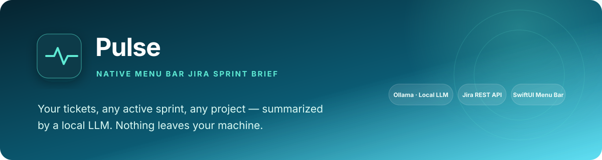
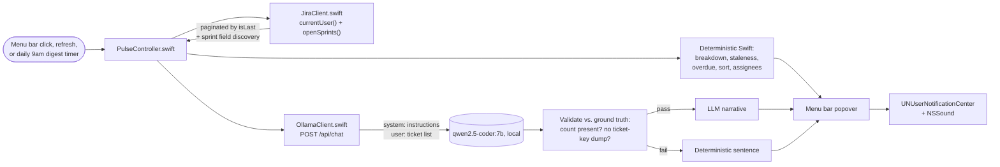

<p align="center">
  
</p>

<div align="center">

# Pulse

### A native menu bar Jira sprint brief, powered by a local LLM

Your tickets, any active sprint, any project — summarized, flagged, and sorted where you can see it at a glance.

[](https://swift.org/)
[]()
[](https://ollama.com)
[](https://developer.atlassian.com/)
[]()
[](LICENSE)

</div>

---

<div align="center">

| Any Jira instance | Local-only | Deterministic-first | Daily digest |
|:---:|:---:|:---:|:---:|
| `currentUser()` + `openSprints()` — no board ID, no instance-specific values baked in | Ollama on-device — ticket data is never sent to a cloud API | Counts, staleness, sorting computed in Swift, not asked of the LLM | Standalone + daily 9am digest notification |

</div>

## Why this exists

Second in a series of native macOS apps built to learn the local-AI
development process by solving real problems on my own machine (the first,
[Lint](../Lint), is a clipboard cleaner). I wanted a fast daily read on what's
actually assigned to me across active sprints, without opening Jira's web UI
every morning — and since it touches ticket data, it is built to stay
entirely local.

**A hard rule enforced throughout:** the tool itself has no instance-specific
logic — one generic JQL query, no hardcoded board or project. No real ticket data,
screenshots, or API responses are committed; every example below is fabricated.

> **Related work in this portfolio:** reuses the menu-bar + Ollama-client
> pattern proven out in [Lint](../Lint) — same `MenuBarExtra` scaffold, same
> notification-sound delegate fix, same local-LLM-only stance.

## What it does

- **Sprint countdown** — shows the actual Jira sprint name and days remaining
  (e.g. "ends in 3d"), pulled from Jira's dynamically-numbered sprint field
- **Staleness flags** — anything "In Progress" with no update in 3+ days gets
  flagged, deterministically, not by asking an LLM to guess
- **Overdue detection** — due date vs. today, flagged the same way
- **Priority-first sorting** — each project's list sorts overdue, then stale,
  then by priority, instead of raw API order
- **Per-assignee breakdown** — ticket counts per teammate, useful once you
  point it at a whole project's sprint, not just your own tickets
- **"Copy for Standup"** — formats today's data into a ready-to-paste
  What I did / Today / Blockers update
- **Daily digest** — a background check fires a notification once per day at
  9am local, so it's a habit-former, not just something you have to remember
  to open

## At a glance

| | |
|---|---|
| **Problem** | Checking Jira's web UI every morning for what's actually on your plate — and what's quietly stalling — is slow and easy to skip |
| **Approach** | One JQL query pulls tickets from any project; deterministic Swift computes counts/staleness/sorting; a local model adds a short narrative on top, but only when it's actually reliable |
| **Proof** | Exercised by hand against a Jira Cloud instance (see bugs below); no automated tests |
| **Output** | Status counts, flagged tickets, a short brief, and a one-click standup export, all refreshed on open, on demand, or daily at 9am |

## Competencies demonstrated

| Competency | Observable evidence |
|---|---|
| API integration | Jira REST v3 search, paginated correctly against the API's actual (not assumed) response shape; dynamic custom-field discovery for sprint data |
| Local LLM integration, with real skepticism | Ollama `/api/chat` summarization whose output is validated against ground truth (correct count present, no redundant ticket-key dump) before ever being shown — added after repeated failure modes seen with local models during manual use |
| Deterministic-first design | Status counts, staleness, overdue, sorting, and assignee breakdown are all plain Swift computation — the LLM's job is deliberately minimized to what it's actually reliable at |
| Debugging under ambiguity | Diagnosed a silent decode failure via request/response logging; diagnosed an AI reliability failure via a synthetic side-by-side model comparison before touching app code |
| macOS platform depth | Window-state restoration, Keychain ACL/code-signing behavior, and SwiftUI layout sizing — three distinct root causes found and fixed |
| Security-conscious design | Generic-by-default query (no hardcoded instance data), credentials never committed, no real ticket data committed |

## Real example

*(Fabricated data — no real ticket content, project names, or people appear here or anywhere else in this repo.)*

**Brief, healthy sprint:**
> 3 tickets in active sprints. Nothing overdue or stale — steady state.

**Brief, needs attention:**
> 2 ticket(s) overdue, 5 gone 3+ days without an update — worth a check-in.

**By assignee** (shown once a watched project pulls in more than just your own tickets):
> Jane Doe — 6 · John Smith — 4 · Unassigned — 1

## Five real bugs found building this

1. **A crash on every relaunch, from a subsystem this app doesn't even use.**
   Menu-bar-only apps have no real windows, but macOS still tried to *restore*
   one on launch (`NSPersistentUIRestorer` → `AppWindowsController.restoreWindow`),
   crashing with a bare `Fatal error` and no useful message. Root-caused via
   `bt` in the attached debugger, which showed the crash originating from an
   AppleEvent-triggered reopen path — running *before* `applicationDidFinishLaunching`,
   so setting the activation policy in code was always too late. Fixed by
   declaring `LSUIElement = YES` directly in Info.plist, so macOS treats the
   process as an agent from the moment it launches.

2. **A "the data couldn't be read" error that was actually a valid, successful
   response.** Every fetch failed with a raw decode error, with no indication
   why. Added request/response logging (URL, HTTP status, raw body) and
   discovered Jira was returning `HTTP 200` with `{"issues":[],"isLast":true}`
   the whole time — a completely valid empty result. The bug was in the Swift
   model: it required a `total` field for pagination that this endpoint's
   real response doesn't include at all (it uses `isLast` instead). Fixed by
   matching the model to the actual response shape rather than an assumed one.

3. **A view that rendered nothing, with no error and no crash.** The brief
   text area (and later, a group header) was consistently blank or truncated
   even on a successful fetch. Cause: a `ScrollView` inside a self-sizing
   menu-bar popover has no intrinsic content size and silently collapses to
   zero height without an explicit `minHeight`; separately, a long project
   name ate the horizontal space a sprint countdown needed on the same line.
   Fixed by dropping the `ScrollView` in favor of plain, growing `Text`, and
   splitting the header into two lines so neither element starves the other.

4. **"Always Allow" that never actually stuck.** Every rebuild re-prompted for
   Keychain access, even after repeatedly granting it. Root cause: with no
   paid Developer Team, ad-hoc "Sign to Run Locally" produces a new code
   signature on every build, and Keychain ACLs are tied to that signature —
   so each rebuild looked like a genuinely different app asking for the first
   time. Rather than fight the signing setup, switched credential storage to
   a local file outside the Keychain entirely (still never committed to git),
   eliminating the friction at its source.

5. **An LLM that failed the same task four different ways at larger
   ticket counts, despite passing small tests.** Once the list crossed ~20 tickets,
   the model hallucinated a claim on every single item, then on a later run
   flatly denied any tickets existed despite receiving them in the prompt,
   then produced a bare list with no synthesis, then — even when otherwise
   coherent — redundantly enumerated ticket keys the UI already showed
   elsewhere. A side-by-side test with fabricated tickets confirmed a larger local model handled the same scale correctly,
   but the deeper fix was architectural, not just a bigger model: validate
   the LLM's output against ground truth (does it mention the actual count?
   does it duplicate ticket keys we can check for directly?) and fall back
   to a deterministic sentence — one that adds real signal instead of
   repeating numbers already visible elsewhere in the UI — whenever it fails
   that check.

## Architecture



## Setup

Requires [Ollama](https://ollama.com) running locally with a model pulled:

```bash
brew install ollama
ollama pull qwen2.5-coder:7b
```

Open `Pulse.xcodeproj` in Xcode and run, or build a standalone copy:

```bash
xcodebuild -project Pulse.xcodeproj -scheme Pulse -configuration Release build
```

On first launch, enter your Jira Cloud URL, email, and an
[API token](https://id.atlassian.com/manage-profile/security/api-tokens) —
stored locally, never in this repo. Optionally also enter a project key to
watch that project's whole active sprint, not just your own tickets.

## Usage

1. Click the waveform menu bar icon for your current brief, or the refresh icon to pull the latest
2. Click any ticket row to open it directly in Jira
3. Click **Copy for Standup** to get a ready-to-paste status update on your clipboard
4. It also checks in on its own once a day at 9am — no action needed

## Contact

<div align="center">

### **Navi Sohi**
*Technical Program Manager & Automation Engineer*

<a href="https://www.linkedin.com/in/navisohi/"></a>
<a href="https://github.com/PlainJane20"></a>
<a href="mailto:nks.ai.dev@gmail.com"></a>

</div>

## License

Copyright © 2026 Navi Sohi.

This project is distributed under the [MIT License](LICENSE). Reuse is permitted under the
license terms, provided the copyright and license notice are retained in copies or substantial
portions of the software.
