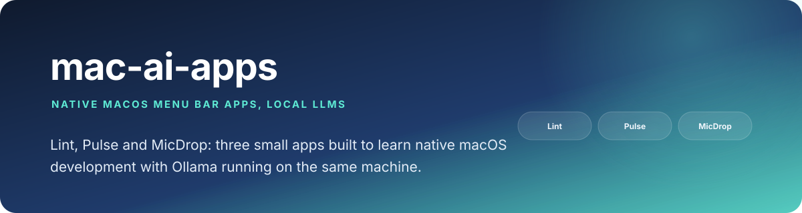
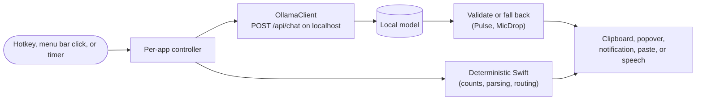

<p align="center">
  
</p>

<div align="center">

# mac-ai-apps

### Native macOS menu bar apps that use a local LLM

Three small apps, each solving a problem I have, built to learn native macOS development and local-model integration end to end.

[](https://swift.org/)
[]()
[](https://ollama.com)
[]()
[](LICENSE)

</div>

---

Each app is a SwiftUI `MenuBarExtra` that talks to [Ollama](https://ollama.com) on
`localhost:11434`. Lint cleans clipboard text, Pulse summarizes your Jira sprint,
and MicDrop turns a spoken phrase into either cleaned-up dictation or a command.
They are separate Xcode projects with no shared package.

## Why this exists

I wanted to learn the native-app and local-AI development process by building
things I would actually use, rather than reading about it. I chose local models on
purpose: these apps touch clipboard contents, ticket data and voice, and none of
that needs to leave the machine. A recurring theme is not trusting a small model:
Pulse validates the model's output against computed facts, and MicDrop falls back
to plain dictation whenever intent classification is unsure.

## At a glance

| | |
|---|---|
| **Problem** | Everyday text cleanup, sprint status and voice input, without sending data to a cloud API |
| **Approach** | Small native apps, global hotkeys or a menu bar popover, Ollama over local HTTP, deterministic code for anything that can be computed |
| **Proof** | Source in this repo; tried by hand. There are no automated tests or CI |
| **Output** | Lint: cleaned clipboard. Pulse: sprint brief and standup text. MicDrop: pasted dictation or an executed command |

## Competencies demonstrated

| Competency | Observable evidence |
|---|---|
| Native macOS development | `MenuBarExtra`, AppKit interop, Carbon `RegisterEventHotKey` global hotkeys, EventKit, IOKit, AppleScript, simulated paste via CGEvent |
| Local LLM integration | Ollama `/api/chat` clients using separate system and user messages; JSON-mode intent classification in MicDrop |
| Defensive use of small models | Pulse checks the LLM brief against ground truth and falls back to a deterministic sentence; MicDrop defaults to dictation when unsure |
| Safe actions | MicDrop Slack sends wait for an explicit Confirm click |
| API integration | Jira REST v3 search with pagination by `isLast` and sprint field discovery (Pulse); Slack Web API (MicDrop) |
| Debugging | Per-app write-ups of root-caused bugs in the Lint and Pulse READMEs |
| Secrets hygiene | No credentials in the repo; local `0600` files outside it, plus Keychain storage code in Pulse |

## Related work in this portfolio

- [edge-sentinel](https://github.com/PlainJane20/edge-sentinel): a decision cascade where a deterministic limit runs first, a fast typed model second, and an LLM only when unsure, with a policy layer deciding what is allowed. Same instinct as MicDrop's "fall back to the safe default when the model is unsure".
- [switchboard](https://github.com/PlainJane20/switchboard): deterministic routing with an LLM fallback, a close cousin of MicDrop's intent routing.
- [it-agent-platform](https://github.com/PlainJane20/it-agent-platform): a propose, approve, execute flow, similar in spirit to MicDrop's confirm-before-send step.

## The apps

### [Lint](Lint/README.md)
Menu bar clipboard cleaner. `Cmd+Shift+V` sends the clipboard text to Ollama
(`llama3.2:latest`) with a cleanup system prompt, writes the result back to the
clipboard, and plays a sound. Also available from the menu bar. App Sandbox on,
network client entitlement only.

### [Pulse](Pulse/README.md)
Menu bar Jira sprint brief. Runs one generic query
(`assignee = currentUser() AND sprint in openSprints()`) against any Jira Cloud
site, computes counts, overdue and stale flags (in progress for 3+ days), sorting
and per-assignee breakdowns in Swift, and asks Ollama (`qwen2.5-coder:7b`) only for
a short narrative that is validated before being shown. Includes a Copy for
Standup action and a daily 9am notification digest. Credentials are entered once
and stored in a local file.

### [MicDrop](MicDrop/README.md)
Menu bar voice assistant, work in progress. `Cmd+Option+D` records, WhisperKit
transcribes on-device, and an Ollama classifier picks dictation (clean and paste at
the cursor) or one of eleven commands: calendar, reminders, notes, battery, volume,
web search, open app, music, timers, Slack and a Jira sprint count. Slack sends
require confirmation. Gmail is not built.

## Architecture and shared patterns



There is no shared package; each app is small enough that copying a pattern was
simpler than extracting a library. Reused by hand: the `MenuBarExtra` scaffold, the
Ollama HTTP client shape, the `UNUserNotificationCenterDelegate` used so
foreground notifications show with sound, and the Carbon global hotkey (no
third-party dependency). The only third-party package is WhisperKit, used by
MicDrop.

## Setup

Requires macOS with Xcode (the projects target macOS 15.5) and
[Ollama](https://ollama.com):

```bash
brew install ollama
ollama pull llama3.2          # Lint and MicDrop
ollama pull qwen2.5-coder:7b  # Pulse
```

Open the app's `.xcodeproj` in Xcode and run, for example `Lint/Lint.xcodeproj`.
Pulse asks for a Jira Cloud URL, email and
[API token](https://id.atlassian.com/manage-profile/security/api-tokens) on first
launch. MicDrop needs microphone, Accessibility, notification, Calendar and
Reminders permissions, and downloads a WhisperKit model on first run. See each
app's README for details.

## Known limitations

- No automated tests and no CI; everything was checked by hand.
- No code-signing identity is configured; builds use the local ad-hoc setup, which
  is why Pulse stores credentials in a local file instead of the Keychain.
- MicDrop is unfinished: no Gmail command, reminders have no due dates, and
  "unmute" cannot be reached because it matches the mute check first.
- MicDrop is not sandboxed and writes debug lines (including transcripts) to
  `/tmp/micdrop-debug.log`; Pulse also has a debug log and is not sandboxed.
- Small local models are unreliable for open-ended tasks, which is why the apps
  validate or constrain their output.
- Apps are not packaged or notarized; run them from Xcode or a local Release build.

## Repository map

```text
Lint/        clipboard cleaner (Xcode project, README, banner)
Pulse/       Jira sprint brief (Xcode project, README, banner)
MicDrop/     voice assistant, work in progress (Xcode project, README)
docs/        banner for this README
LICENSE      MIT
```

## Contact

<div align="center">

### **Navi Sohi**
*Technical Program Manager & Automation Engineer*

<a href="https://www.linkedin.com/in/navisohi/"></a>
<a href="https://github.com/PlainJane20"></a>
<a href="mailto:nks.ai.dev@gmail.com"></a>

</div>

## License

Copyright © 2026 Navi Sohi.

Distributed under the [MIT License](LICENSE). Reuse is permitted under the license
terms, provided the copyright and license notice are retained in copies or
substantial portions of the software.
